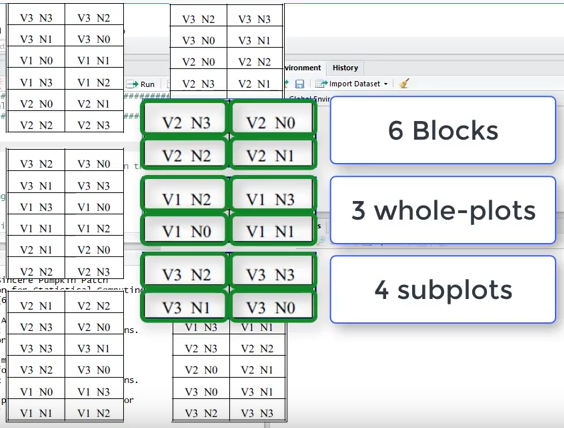

```{r setup, include=FALSE}
knitr::opts_chunk$set(echo = TRUE, eval = FALSE)
```

# Resources

-   <https://www.nature.com/articles/nmeth.3293>
-   <https://www.youtube.com/watch?v=PReZJHaETnQ>
-   <https://stat.ethz.ch/~meier/teaching/anova/index.html>

```{r eval = T}
pacman::p_load(tidyverse)
```

# Oats data



```{r eval = T}
dat <- agridat::yates.oats
dat %>% str
```

```{r eval = T}
dat %>% 
ggplot(aes(x = nitro, y = yield, group = gen, colour = gen)) + 
  geom_line() + 
  facet_wrap(~ block) + 
  theme_bw()
```

# lme4

```{r}
pacman::p_load(lme4, emmeans, multcomp)

fit.oats <- lmer(yield ~ gen * factor(nitro) +  # fixed 
                        (1|block/gen),  # random
                        data = dat)
car::Anova(fit.oats)
plot(fit.oats)
```

Comparar gen dentro de nitro
```{r}
em_oats_gen <- emmeans(fit.oats, ~ gen | nitro, type = "response")
res_oats_gen <- cld(em_oats_gen, alpha=.05, Letters=letters)
res_oats_gen
```

Comparar nitro dentro de gen

```{r}
em_oats_nitro <- emmeans(fit.oats, ~ nitro | gen, type = "response")
res_oats_nitro <- cld(em_oats_nitro, alpha=.05, Letters=letters)
res_oats_nitro
```


# doebioresearch

```{r }
pacman::p_load(doebioresearch)

output <- splitplot(oats[4],      # variable resp
                    oats$block,   # bloque
                    oats$gen,     # FA
                    oats$nitro,   # FB
                    1)            # Post-hoc test
output
```

# nlme

```{r }
pacman::p_load(nlme)

m1 <- lme(yield ~ nitro * gen, 
                  random = ~1 | block/gen, # whole plot: block / sub-plot: block:gen
           data = dat)
m1

emmeans::emmeans(m1, "gen")
```
